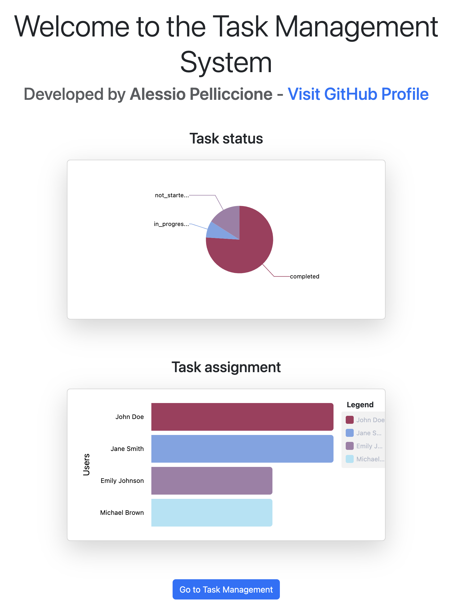
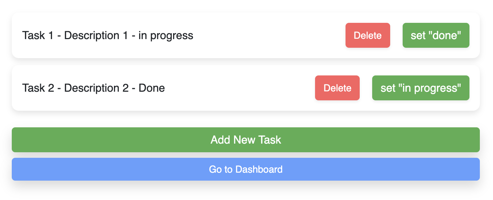

# Task Management System - Frontend

This repository contains the frontend for the Task Management System, a web application built with Angular 15+ that allows users to manage tasks with an advanced authentication and role-based access control system. The application features a dynamic, interactive dashboard and complete CRUD operations for tasks.

## Features

- **User Authentication & Authorization (in progress)**: Login and registration with JWT-based session management. Role-based access (Admin and User) with protected routes.
- **Task Dashboard**: Interactive charts displaying task statistics (e.g., status distribution and task assignment per user) using `ngx-charts`.



- **Task Management**: Full CRUD operations for tasks.



- **Role-based Layouts (in progress)**: Different layouts for Admin and User roles.
- **Lazy Loading (in progress)**: Optimized module loading for faster application performance.

## Technologies

- **Frontend Framework**: Angular 15+
- **Charting Library**: ngx-charts
- **Authentication (in progress)**: JWT for session management
- **HTTP Client**: Angular HttpClient for communication with the backend API
- **Testing (in progress)**: Jasmine and Karma for unit tests

## Getting Started

### Prerequisites

- **Node.js** (version 16 or higher recommended)
- **Angular CLI** (version 15 or higher)

### Installation

1. Clone the repository:

   ```bash
   git clone https://github.com/yourusername/task-management-frontend.git
   ```

2. Navigate to the project directory:

   ```bash
   cd task-management-frontend
   ```

3. Install the dependencies:

   ```bash
   npm install
   ```

### Configuration

- Open `src/environments/environment.ts` and configure the backend API URL:

  ```typescript
  export const enviroment = {
    production: false,
    apiUrl: 'http://localhost:3000' // Backend API URL
  };
  ```

- Install `json-server` to use a mock database for local testing:

  ```bash
  npm install -g json-server
  ```

- Start `json-server`:

  ```bash
  json-server --watch db.json --port 8080
  ```

### Running the Application

To start the application in development mode:

```bash
ng serve
```

Navigate to `http://localhost:4200` in your browser.

### Building for Production

To build the project for production:

```bash
ng build --prod
```

The production-ready files will be generated in the `dist/` directory.

## Project Structure

- **/src/app/core** - Contains core services (authentication (in progress), task service) and route guards.
- **/src/app/shared** - Shared components, models, and utilities used across the app.
- **/src/app/features** - Contains feature modules like `dashboard` and `task` (in progress).
- **/src/app/auth (in progress)** - Authentication module with login, registration, and route guards.

## Usage

### Authentication and Authorization (in progress)

- Users can register and log in.
- JWT tokens are stored in `localStorage` and used to protect routes and manage session expiration.
- Admin and User roles have different access permissions.

### Dashboard

- Interactive charts display task statistics, such as:
  - Task completion status (e.g., completed, in progress, not started)
  - Task assignment by user
- The dashboard connects to backend endpoints to fetch aggregated data.

### Task Management

- Users can create, update, delete for tasks.
- Admins have additional permissions for advanced task management. (in progress)

## Testing (in progress)

Run unit tests using Karma and Jasmine:

```bash
ng test
```

## Deployment (in progress)

To deploy the frontend, ensure you have set up the correct production backend API URL in `environment.prod.ts` and then build the app:

```bash
ng build --prod
```

Upload the `dist/` folder contents to your web server.

## Docker Support (Optional) (in progress)

For Docker deployment, create a Dockerfile to containerize the Angular app:

```dockerfile
# Dockerfile
FROM node:16-alpine AS build
WORKDIR /app
COPY package.json .
RUN npm install
COPY . .
RUN npm run build --prod

FROM nginx:alpine
COPY --from=build /app/dist/task-management-frontend /usr/share/nginx/html
EXPOSE 80
```

Then, build and run the container:

```bash
docker build -t task-management-frontend .
docker run -d -p 80:80 task-management-frontend
```

## License

This project is licensed under the MIT License.

## Acknowledgments

Special thanks to all contributors and open-source projects that made this application possible.

---

### Note

This is the frontend for the Task Management System. Make sure to set up and start the [backend repository](https://github.com/yourusername/task-management-backend) before running the frontend.
